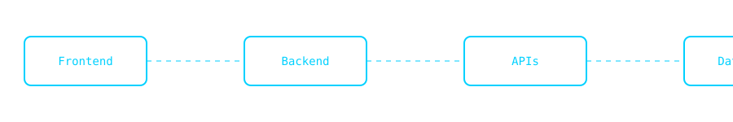
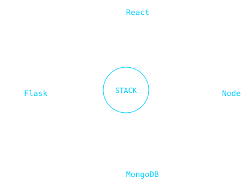

  

<h2 align="center">Subash B</h2>

Full Stack Developer • B.Tech CSE (AI)  
Building scalable web applications and intelligent systems

---

### 👨‍💻 About Me

I am a full stack developer focused on designing and building real-world applications.  
I enjoy working across frontend, backend, APIs, and databases with a strong interest in clean architecture and performance.

---

  

---

### 🧩 Technology Stack

  

---

### 📊 GitHub Stats

  
  

---

### 🤝 Connect

- 🌐 Portfolio: https://next-gen-coder-2007.github.io/personal-portfolio  
- 💼 LinkedIn: https://linkedin.com/in/subash-baskaran  
- 📧 Email: subash59245@gmail.com  

---

> *“I build systems, not just pages.”*
